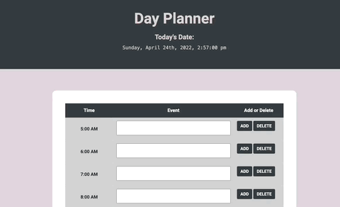

# Day-Planner

## Table of Contents
1. Description
2. Installation
3. Deployed Link
4. Built With
5. Usage
6. Contributers


## Description
 Day Planner is a Javascript tool to help users start every day off on the right foot and get organized to increase productivity.


## Installation 
 * Install latest version of Homebrew 
```
[Homebrew Installation](https://docs.brew.sh/Installation)
```

* Navigate to your GitHub account

* Navigate to the repository code page [github repository](https://github.com/Miacarmen/Day-Planner)

* Click the green clone button and copy the link for the SSH 
```
git@github.com:Miacarmen/Day-Planner.git
```
* Open terminal or bash and enter 

* Now let's clone the newly created repository to the local machine. We can start to do so by clicking the green Code button, selecting the SSH option, and copying the value provided

* To perform the clone operation, you'll need to use the `git clone` command from your command line. Make sure that you've navigated to the location you want your repository to be cloned to using the `cd` command, and then clone the repo with the following command:

  ```bash
  # replace the last value with the one you copied from your GitHub repository
  git clone git@github.com:lernantino/conflict-resolution.git
  ```

* Once it's done cloning to your machine, navigate to the cloned repository's directory using the `cd` command.


## Deployed Link

* [See live Site Here](https://miacarmen.github.io/Day-Planner/)


## Built With

* [HTML](https://developer.mozilla.org/en-US/docs/Web/HTML)
* [CSS](https://developer.mozilla.org/en-US/docs/Web/CSS)
* [Javascript](https://developer.mozilla.org/en-US/docs/Web/JavaScript)
* [JQuery](https://developer.mozilla.org/en-US/docs/Glossary/jQuery)
* [Moment.js](https://momentjs.com/)
* [Bootstrap](https://getbootstrap.com/docs/4.5/getting-started/introduction/)


## Usage
* Current date and time displayed at the top of the page
* Add or Delete tasks for each hour
* Live time update highlights the current task to be completed, which are to be done in the future, and which are in the past



## Authors
* **Mia Carmen**

- [Link to Portfolio](https://miacarmen.github.io/my-portfolio/)
- [Link to Github](https://github.com/Miacarmen)
- [Link to LinkedIn](https://www.linkedin.com/in/mia-carmen-7750a6b8/)